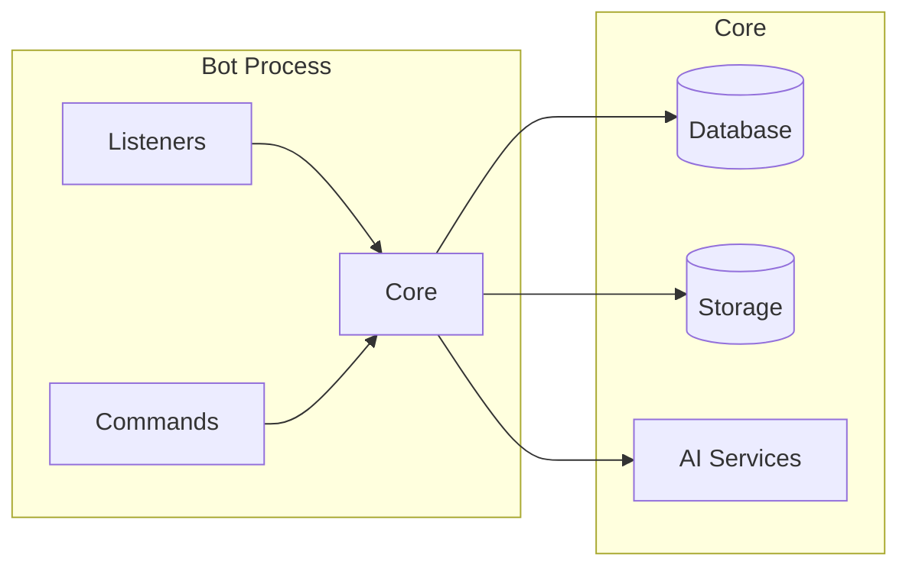
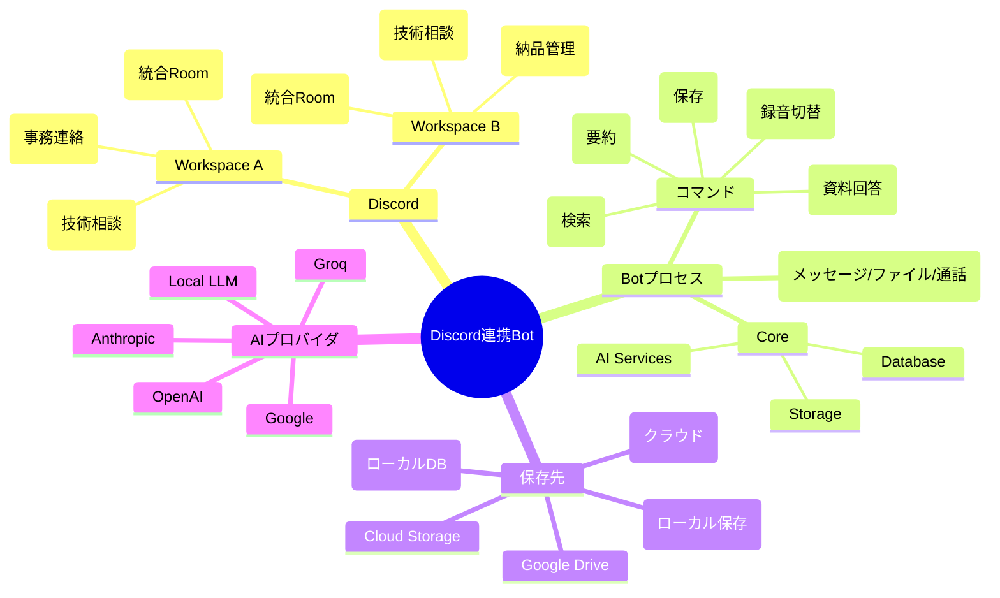

# Machine Diagrams (Existing Components)

This document captures deployment-style diagrams for existing components. The diagrams focus on machine/process boundaries and external services.

## 1. System Nodes (Current Target)

```mermaid
flowchart LR
  subgraph Discord[Discord Platform]
    WS_A[Workspace A]\nRooms
    WS_B[Workspace B]\nRooms
  end

  subgraph UserPC[Local PC]
    BOT[Bot Process]\n(discord.py)
    DB[(SQLite DB)]
    FS[(Local Filesystem)]
    BOT --> DB
    BOT --> FS
  end

  subgraph AI[AI Providers]
    OPENAI[OpenAI API]
    ANTHROPIC[Anthropic API]
    GOOGLE[Google API]
    GROQ[Groq API]
    LOCAL[Local LLM]
  end

  WS_A -->|Discord API| BOT
  WS_B -->|Discord API| BOT
  BOT -->|API calls| OPENAI
  BOT -->|API calls| ANTHROPIC
  BOT -->|API calls| GOOGLE
  BOT -->|API calls| GROQ
  BOT -->|API calls| LOCAL
```

## 2. Local Runtime (Phase 1)

```mermaid
flowchart TB
  subgraph Discord[Discord]
    API[Discord API]
  end

  subgraph LocalPC[Local PC (macOS/Windows)]
    BOT[Bot Process]\n(discord.py)
    DB[(SQLite DB)]
    STORE[(Local Storage)]
    BOT --> DB
    BOT --> STORE
  end

  subgraph AI[AI Providers]
    AIP[External AI APIs]
  end

  API --> BOT
  BOT --> AIP
```

## 3. Cloud Runtime (Phase 3)

```mermaid
flowchart TB
  subgraph Discord[Discord]
    API[Discord API]
  end

  subgraph Drive[Google Drive]
    GDRIVE[Drive API]
  end

  subgraph Fly[Fly.io (Docker)]
    BOT[Bot Process]\n(discord.py)
    DB[(PostgreSQL)]
    STORE[(Cloud Storage)]
    BOT --> DB
    BOT --> STORE
  end

  subgraph AI[AI Providers]
    AIP[External AI APIs]
  end

  API --> BOT
  GDRIVE --> STORE
  BOT --> AIP
```

## 4. Internal Component Boundaries (Bot Process)



## 5. 人間にわかりやすいMAP（日本語）


